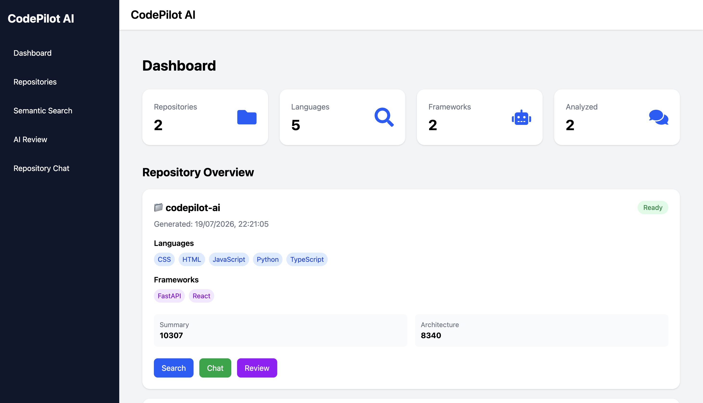
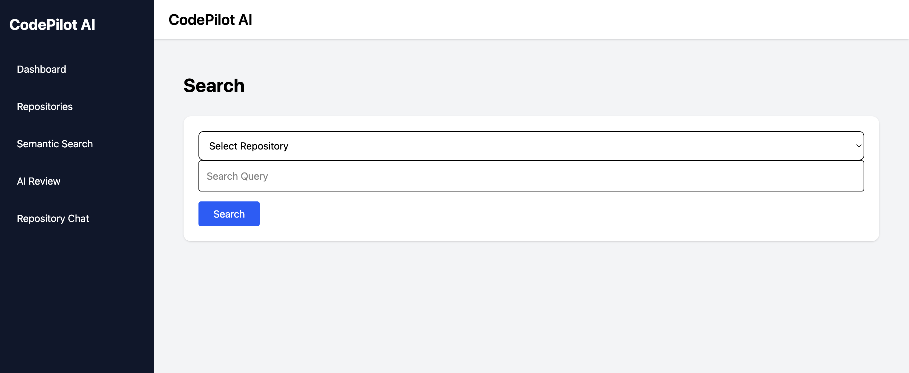
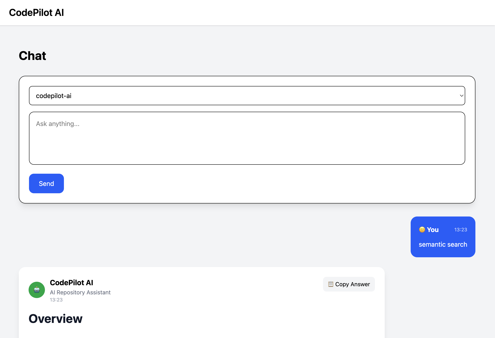
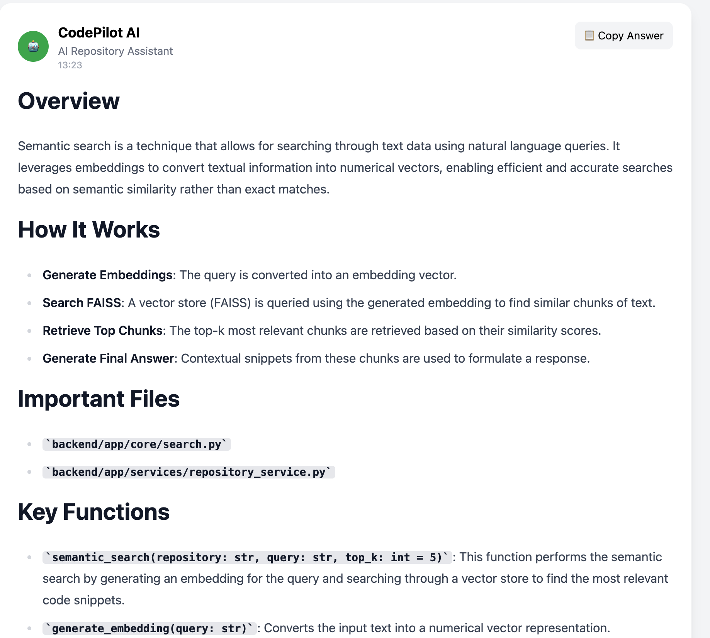
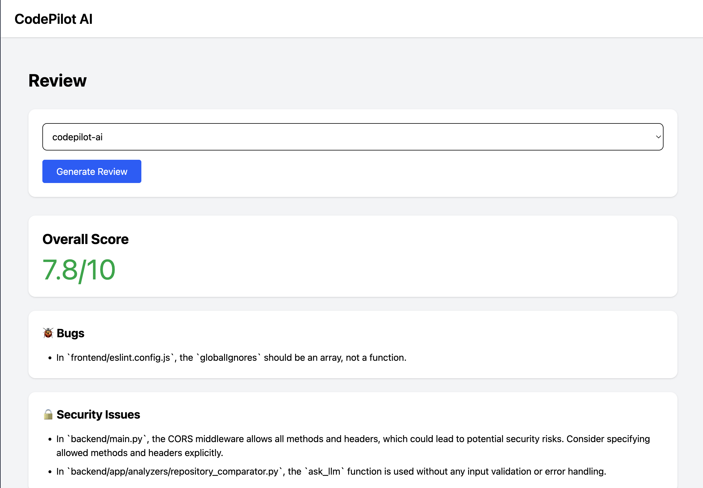

# 🚀 CodePilot AI

> AI-powered GitHub Repository Analyzer with Semantic Search, AI Code Review, Repository Chat, and Interactive Dashboard.


---

## 📖 Overview

CodePilot AI is an AI-powered developer assistant that analyzes GitHub repositories using Large Language Models (LLMs), vector embeddings, and semantic search.

Instead of manually browsing hundreds of files, developers can:

- 🔍 Search code using natural language
- 💬 Chat with an entire repository
- 🤖 Generate AI-powered code reviews
- 📊 Explore repository insights through an interactive dashboard

---

# ✨ Features

### 🔍 Semantic Code Search

Search repositories using natural language instead of keywords.

Example:

> "Where is JWT authentication implemented?"

---

### 💬 Repository Chat (RAG)

Ask questions about any repository.

Examples:

- Explain authentication flow
- How does the API work?
- Which files handle database connections?

---

### 🤖 AI Code Review

Automatically review code and identify:

- Bugs
- Security issues
- Performance improvements
- Best practice violations
- Refactoring suggestions

---

### 📊 Repository Dashboard

Visualizes:

- Languages used
- Folder structure
- File statistics
- Repository metadata

---

### 📂 GitHub Repository Analysis

Clone and analyze public GitHub repositories automatically.

---

# 🏗️ Architecture

```
                GitHub Repository
                        │
                        ▼
               Repository Cloner
                        │
                        ▼
              Repository Analyzer
                        │
      ┌─────────────────┴────────────────┐
      ▼                                  ▼
 Semantic Search                  AI Code Review
      │                                  │
      ▼                                  ▼
   FAISS Index                    Gemini / Ollama
      │                                  │
      └──────────────┬───────────────────┘
                     ▼
                FastAPI Backend
                     │
               REST API Endpoints
                     │
                     ▼
             React + TypeScript UI
```

---

# 🛠️ Tech Stack

## Backend

- FastAPI
- Python
- FAISS
- Sentence Transformers
- Google Gemini API
- Ollama
- GitPython

## Frontend

- React
- TypeScript
- Tailwind CSS
- Axios
- React Router
- React Markdown

---

# 📂 Project Structure

```text
CodePilot AI/
│
├── backend/
│   ├── app/
│   ├── api/
│   ├── services/
│   ├── models/
│   ├── storage/
│   ├── requirements.txt
│   └── .env.example
│
├── frontend/
│   ├── src/
│   ├── public/
│   ├── package.json
│   └── .env.example
│
├── README.md
└── .gitignore
```

---

# ⚙️ Installation

## Clone Repository

```bash
git clone https://github.com/<username>/codepilot-ai.git

cd codepilot-ai
```

---

## Backend Setup

```bash
cd backend

python -m venv venv

source venv/bin/activate
```

Windows

```bash
venv\Scripts\activate
```

Install dependencies

```bash
pip install -r requirements.txt
```

Create `.env`

```env
GEMINI_API_KEY=your_api_key
```

Run backend

```bash
uvicorn main:app --reload
```

Backend runs at

```
http://localhost:8000
```

---

## Frontend Setup

```bash
cd frontend

npm install
```

Create `.env`

```env
VITE_API_URL=http://localhost:8000
```

Run frontend

```bash
npm run dev
```

Frontend runs at

```
http://localhost:5173
```

---

# 📸 Screenshots

## Dashboard



---

## Semantic Search



---

## Repository Chat




---

## AI Code Review




---

# 🌐 API Documentation

FastAPI automatically generates Swagger documentation.

```
http://localhost:8000/docs
```

---

# 🚀 Future Improvements

- User authentication
- Repository history
- Multi-user support
- PDF report generation
- Repository comparison
- Docker deployment
- Kubernetes support

---

# 🤝 Contributing

Contributions are welcome.

1. Fork the repository
2. Create a feature branch

```
git checkout -b feature/new-feature
```

3. Commit changes

```
git commit -m "feat: add new feature"
```

4. Push branch

```
git push origin feature/new-feature
```

5. Open a Pull Request

---

# 🚀 Future Roadmap

- User Authentication
- Repository Comparison
- Multi-user Workspace
- Docker Deployment
- Kubernetes Deployment
- PDF Report Export
- CI/CD Integration

---

# 👨‍💻 Author

**Divakar Maurya**

- GitHub: https://github.com/div339175
- LinkedIn: https://www.linkedin.com/in/divakar-maurya-a4a6a2313/

---

## 🙌 Feedback

Feedback, suggestions, and contributions are always welcome.
If you found this project useful, consider giving it a ⭐ on GitHub.